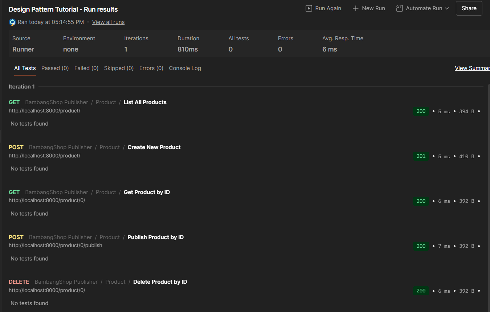
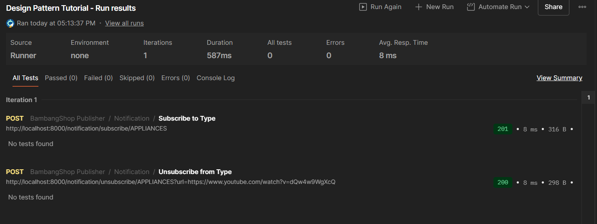

# BambangShop Publisher App
Tutorial and Example for Advanced Programming 2024 - Faculty of Computer Science, Universitas Indonesia

---

## About this Project
In this repository, we have provided you a REST (REpresentational State Transfer) API project using Rocket web framework.

This project consists of four modules:
1.  `controller`: this module contains handler functions used to receive request and send responses.
    In Model-View-Controller (MVC) pattern, this is the Controller part.
2.  `model`: this module contains structs that serve as data containers.
    In MVC pattern, this is the Model part.
3.  `service`: this module contains structs with business logic methods.
    In MVC pattern, this is also the Model part.
4.  `repository`: this module contains structs that serve as databases and methods to access the databases.
    You can use methods of the struct to get list of objects, or operating an object (create, read, update, delete).

This repository provides a basic functionality that makes BambangShop work: ability to create, read, and delete `Product`s.
This repository already contains a functioning `Product` model, repository, service, and controllers that you can try right away.

As this is an Observer Design Pattern tutorial repository, you need to implement another feature: `Notification`.
This feature will notify creation, promotion, and deletion of a product, to external subscribers that are interested of a certain product type.
The subscribers are another Rocket instances, so the notification will be sent using HTTP POST request to each subscriber's `receive notification` address.

## API Documentations

You can download the Postman Collection JSON here: https://ristek.link/AdvProgWeek7Postman

After you download the Postman Collection, you can try the endpoints inside "BambangShop Publisher" folder.
This Postman collection also contains endpoints that you need to implement later on (the `Notification` feature).

Postman is an installable client that you can use to test web endpoints using HTTP request.
You can also make automated functional testing scripts for REST API projects using this client.
You can install Postman via this website: https://www.postman.com/downloads/

## How to Run in Development Environment
1.  Set up environment variables first by creating `.env` file.
    Here is the example of `.env` file:
    ```bash
    APP_INSTANCE_ROOT_URL="http://localhost:8000"
    ```
    Here are the details of each environment variable:
    | variable              | type   | description                                                |
    |-----------------------|--------|------------------------------------------------------------|
    | APP_INSTANCE_ROOT_URL | string | URL address where this publisher instance can be accessed. |
2.  Use `cargo run` to run this app.
    (You might want to use `cargo check` if you only need to verify your work without running the app.)

## Mandatory Checklists (Publisher)
-   [ ] Clone https://gitlab.com/ichlaffterlalu/bambangshop to a new repository.
-   **STAGE 1: Implement models and repositories**
    -   [ ] Commit: `Create Subscriber model struct.`
    -   [ ] Commit: `Create Notification model struct.`
    -   [ ] Commit: `Create Subscriber database and Subscriber repository struct skeleton.`
    -   [ ] Commit: `Implement add function in Subscriber repository.`
    -   [ ] Commit: `Implement list_all function in Subscriber repository.`
    -   [ ] Commit: `Implement delete function in Subscriber repository.`
    -   [ ] Write answers of your learning module's "Reflection Publisher-1" questions in this README.
-   **STAGE 2: Implement services and controllers**
    -   [ ] Commit: `Create Notification service struct skeleton.`
    -   [ ] Commit: `Implement subscribe function in Notification service.`
    -   [ ] Commit: `Implement subscribe function in Notification controller.`
    -   [ ] Commit: `Implement unsubscribe function in Notification service.`
    -   [ ] Commit: `Implement unsubscribe function in Notification controller.`
    -   [ ] Write answers of your learning module's "Reflection Publisher-2" questions in this README.
-   **STAGE 3: Implement notification mechanism**
    -   [ ] Commit: `Implement update method in Subscriber model to send notification HTTP requests.`
    -   [ ] Commit: `Implement notify function in Notification service to notify each Subscriber.`
    -   [ ] Commit: `Implement publish function in Program service and Program controller.`
    -   [ ] Commit: `Edit Product service methods to call notify after create/delete.`
    -   [ ] Write answers of your learning module's "Reflection Publisher-3" questions in this README.

## Your Reflections
This is the place for you to write reflections:

### Mandatory (Publisher) Reflections

#### Reflection Publisher-1
1. Di kasus BambangShop ini, menggunakan satu Model struct saja sudah cukup, 
tidak perlu membuat interface (atau trait di Rust). Pada konsep dasar Observer pattern, 
interface dipakai jika ada banyak jenis objek berbeda yang ingin menjadi subscriber 
dengan cara kerja yang berbeda-beda. Namun, di aplikasi kita, semua subscriber (Receiver app) 
memiliki bentuk dan kebutuhan yang sama persis: mereka hanya butuh url dan name 
untuk menerima notifikasi via HTTP request. Karena perilakunya seragam, 
satu struct saja sudah memenuhi kebutuhan.
2. Penggunaan DashMap diperlukan (lebih baik daripada Vec). Karena url dan id sifatnya unik, 
mereka bertindak sebagai sebuah kunci (key). Jika kita menggunakan Vec (list biasa), 
setiap kali kita ingin mencari, memperbarui, atau menghapus subscriber tertentu, 
program harus mencari satu per satu dari urutan paling awal (memakan waktu lebih lama). 
Dengan DashMap, program bisa langsung melompat ke data yang dicari menggunakan kunci unik tersebut 
dengan sangat cepat. Selain itu, DashMap dirancang khusus agar aman (thread-safe) saat digunakan bersamaan.
3. Kita sebenarnya menggunakan keduanya karena Singleton dan DashMap memecahkan dua masalah yang berbeda. 
Singleton pattern (yang kita terapkan menggunakan lazy_static!) bertugas untuk memastikan bahwa 
hanya ada satu variabel SUBSCRIBERS yang dibagikan ke seluruh program. Sementara itu, DashMap adalah 
tipe struktur datanya yang bertugas memastikan isi data di dalam Singleton tersebut aman saat dibaca atau 
diubah oleh banyak proses (thread) secara bersamaan (thread-safe). Jadi, kita tidak mengganti DashMap 
dengan Singleton, tetapi menerapkan pola Singleton pada sebuah objek DashMap.
#### Reflection Publisher-2
1. Pemisahan ini dilakukan untuk menerapkan prinsip Single Responsibility Principle (SRP) dan Separation of Concerns. 
Jika sebuah Model menangani struktur data, logika bisnis, sekaligus akses ke database, ukurannya akan menjadi 
sangat besar dan sulit dipelihara (God Object). Dengan memisahkannya:  
Model: Hanya fokus mendefinisikan struktur data (representasi objek).   
Repository: Hanya fokus pada operasi database atau penyimpanan (CRUD).   
Service: Hanya fokus pada business logic (aturan bisnis).  
Hal ini membuat kode lebih terstruktur, mudah dites (unit testing), dan mudah dimodifikasi tanpa merusak bagian lain.
2. Jika kita hanya menggunakan Model, kode akan menjadi sangat rumit (high coupling dan low cohesion). Model Product misalnya, 
harus tahu cara menyimpan dirinya sendiri ke database, dan juga harus tahu cara membuat Notification, lalu mencari Subscriber 
untuk mengirim HTTP request. Jika ada perubahan pada cara menyimpan Subscriber, Model Product bisa ikut rusak. Kode akan 
saling tumpang tindih (spaghetti code), sehingga sangat sulit untuk diperbaiki atau ditambahkan fitur baru di masa depan.
3. Postman sangat membantu karena memungkinkan kita menguji endpoints API (seperti GET, POST, DELETE) dengan mudah tanpa harus 
repot-repot membuat antarmuka (frontend) atau client app sungguhan. Beberapa fitur Postman yangmenarik dan berguna untuk 
Group Project ke depan antara lain:  
Collections: Memungkinkan kita mengelompokkan request berdasarkan fitur, sehingga rapi dan mudah dibagikan ke anggota tim.   
Environment Variables: Memudahkan kita mengganti URL dasar (seperti dari localhost ke production server) tanpa harus mengubah URL di setiap request satu per satu.   
Automated Testing (Scripts): Memungkinkan kita menulis script untuk memverifikasi apakah respons dari API sudah sesuai dengan yang diharapkan secara otomatis.
#### Reflection Publisher-3
1. Di tutorial ini, kita menggunakan variasi Push model . Hal ini terlihat jelas karena aplikasi Publisher secara aktif 
mengirimkan data notifikasi (melalui HTTP POST request) langsung ke URL milik Subscriber sesaat setelah suatu event 
(seperti produk dibuat atau dihapus) terjadi. Subscriber hanya diam menunggu data tersebut "didorong" (di-push) 
kepadanya.
2. Jika kita menggunakan Pull model  (di mana Subscriber yang aktif meminta/menarik data dari Publisher), berikut adalah 
kelebihan dan kekurangannya untuk kasus BambangShop:  
Kelebihan : Subscriber tidak akan kewalahan (overwhelmed) menerima banyak request sekaligus jika aplikasi 
sedang sangat sibuk. Mereka bisa menarik data sesuai dengan kapasitas dan waktu luang mereka sendiri.   
Kekurangan : Notifikasi menjadi tidak real-time karena ada jeda sampai Subscriber melakukan pengecekan 
(pull). Selain itu, jika Subscriber terus-menerus mengecek ("Apakah ada produk baru?") padahal tidak ada perubahan, ini 
akan membuang-buang resource jaringan (polling overhead). Publisher juga harus menyimpan riwayat status/notifikasi di memory 
sampai semua Subscriber selesai menarik data tersebut.
3. Jika kita tidak menggunakan multi-threading (alias mengeksekusinya secara synchronous atau satu per satu pada thread 
utama), aplikasi Publisher akan sangat lambat dan rentan hang (macet). Saat sebuah produk baru dibuat, Publisher harus 
menahan proses utama untuk mengirim HTTP request ke Subscriber A sampai selesai, baru lanjut ke Subscriber B, dan seterusnya. 
Jika server Subscriber B sedang mati atau lambat merespons (timeout), seluruh sistem Publisher akan tertahan menunggu. Akibatnya, 
user yang menekan tombol "Create Product" akan mengalami proses loading yang sangat lama. Dengan multi-threading, pengiriman 
notifikasi dilempar ke "belakang layar" (background process) secara paralel sehingga aplikasi utama tetap cepat dan responsif 
mengembalikan pesan sukses ke user.


